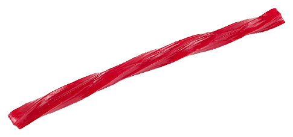

```{r setup, include=FALSE}
library(xaringanthemer)
library(kableExtra)
knitr::opts_chunk$set(echo = F)
style_duo_accent(
  primary_color = "#866fa3",
  secondary_color = "#B6F7C8",
  inverse_header_color = "#464a53",
  black_color = "#464a53",
  header_font_google = google_font("Atkinson Hyperlegible"),
  text_font_google   = google_font("Atkinson Hyperlegible", "300", "300i"),
  code_font_google   = google_font("Source Code Pro"),
  title_slide_background_color = "#FFFFFF",
  title_slide_background_size = "contain",
  base_font_size = "28px",
  extra_css = list(
    "h1" = list("margin-block-start" = "0.4rem", 
                "margin-block-end" = "0.4rem"),
    "h2" = list("margin-block-start" = "0.4rem", 
                "margin-block-end" = "0.4rem"),
    "h3" = list("margin-block-start" = "0.4rem", 
                "margin-block-end" = "0.4rem"),
    ".small" = list("font-size" = "90%"),
    ".midi" = list("font-size" = "150%"),
    ".large" = list("font-size" = "200%"),
    ".xlarge" = list("font-size" = "600%"),
    ".hand" = list("font-family" = "'Gochi Hand', cursive",
                   "font-size" = "125%"),
    ".task" = list("padding-right"    = "10px",
                   "padding-left"     = "10px",
                   "padding-top"      = "3px",
                   "padding-bottom"   = "3px",
                   "margin-bottom"    = "6px",
                   "margin-top"       = "6px",
                   "border-left"      = "solid 5px #F1DE67",
                   "background-color" = "#F1DE6750"),
    ".large" = list("font-size" = "200%"),
    ".pull-left" = list("width" = "49%",
                        "float" = "left"),
    ".pull-right" = list("width" = "49%",
                         "float" = "right"),
    ".pull-left-wide" = list("width" = "70%",
                             "float" = "left"),
    ".pull-right-narrow" = list("width" = "27%",
                                "float" = "right"),
    ".pull-left-narrow" = list("width" = "27%",
                               "float" = "left"),
    ".pull-right-wide" = list("width" = "70%",
                              "float" = "right")
  )
)

```


```{r include = F}
source("licorice.R")
```

class: inverse, reverse

## Motivation

- Double-lumen tubes used in operations are large and tend to provoke sore throats
- A small study suggests that gargling with licorice before induction of anesthesia reduces the risk of postoperative sore throat

```{r, out.width="80%", fig.align = "center", fig.cap="Double-lumen tube"}
knitr::include_graphics("images/double-lumen.png")
```

---

## Introduction

### Study Details

- Double-blind
- 236 patients
  - Undergoing elective thoracic surgery requiring intubation
- Random selection into treatment groups
  - One group gargled *licorice* prior to operation
  - One group gargled *sugar water* prior to operation
- **Outcomes**: sore throat and coughing
  - 30 minutes after operation
  - 90 minutes after operation
  - 4 hours after operation
  - First postoperative morning

---

## Introduction

### Demographics

.pull-left-narrow[
Both treatment groups exhibited similar summary statistics for demographic variables.
]


.pull-right-wide[
```{r}
demographic %>%
  slice(1:3) %>%
  kable(booktabs = T, longtable = TRUE, escape = F,
      col.names = c("Licorice<br>(N=118)", "Sugar-water<br>(N=117)"), align = "rr") %>%
  kable_styling()%>%
    column_spec(1, border_right = T)
```
]


---

## Introduction

### Baseline Characteristics


.pull-left-narrow[
Patients across treatment groups also exhibited similar baseline characteristics.
]


.pull-right-wide[

```{r}
demographic %>%
  slice(5:7, 12:14) %>%
  mutate(rownames = c("Current", "Past", "Never", "I", "II", "III")) %>%
  remove_rownames %>% column_to_rownames(var="rownames") %>%
  kable(booktabs = T, longtable = TRUE, escape = F,
      col.names = c("Licorice<br>(N=118)", "Sugar-water<br>(N=117)"), align = "rr") %>%
  pack_rows("Smoking, n", 1, 3, bold = F, indent = T,
            latex_gap_space = "0.5em", hline_after = F) %>%
  pack_rows("ASA physical status, n", 4, 6,
            latex_gap_space = "0.5em", bold = F, indent = T, hline_after = F) %>%
  kable_styling()%>%
    column_spec(1, border_right = T)
```
]

---

## Results

### Throat Pain by Group


.pull-left-narrow[
Fewer patients who gargled licorice reported sore throats post-operation.
]

.small[
.pull-right-wide[

```{r}
throat_pain %>%
  kable(booktabs = T, longtable = TRUE, escape = F,
      col.names = c("Sore throat at rest", "N (%)", "N (%)", "P-Value"), align = "lrrr") %>%
  add_header_above(c(" "=1, "Licorice (N=117)"=1, "Sugar-water (N=116)"=1,  " "=1)) %>%
  column_spec(4, bold = T) %>%
  kable_styling()%>%
    column_spec(1, border_right = T)
```
]
]
---

## Results

### Risk Ratios

.pull-left-narrow[
The licorice treatment group's relative risk was approximately half
of the control group's.


Held for intention-to-treat and per-protocol population.
]

.pull-right-wide[
```{r}
rr_throat %>%
  kable(booktabs = T, longtable = TRUE, escape = F, align = "lrr")%>%
    column_spec(1, border_right = T)
```
]
---

## Results

### Sore Throat Score

```{r}
score %>%
  kable(booktabs = T, longtable = TRUE, escape = F,
      col.names = c("mean +/- SD", "mean +/- SD", "Difference in means"), align = "rrr") %>%
  add_header_above(c(" "=1, "Licorice (N=117)"=1, "Sugar-water (N=116)"=1,  " "=1)) %>%
  kable_styling()%>%
    column_spec(1, border_right = T)
```

---

## Results

### Coughing by Group

```{r}
cough %>%
  kable(booktabs = T, longtable = TRUE, escape = F,
      col.names = c("Coughing", "N (%)", "N (%)", "P-values"), align = "lrrr") %>%
  add_header_above(c(" "=1, "Licorice (N=117)"=1, "Sugar-water (N=116)"=1, " " = 1)) %>%
  kable_styling()%>%
    column_spec(1, border_right = T)
```


---

## Interpretation of Results

- This study found that patients gargling licorice prior to operation
significantly reduces incidence of postoperative sore throat vs. sugar-water
  - Matched small previous study almost exactly
- Pain in the treatment group that gargled licorice was rated as less severe
- Coughing was also reported to be less frequent in the group that gargled
licorice

```{r, out.width="45%", fig.align = "center", fig.cap="Red licorice"}

```

---

class: inverse, reverse

## Takeaway

.hand[
Licorice gargling prior to the induction of anesthesia appears to be an easy, useful
measure in preventing postoperative throat soreness and coughing!
]


